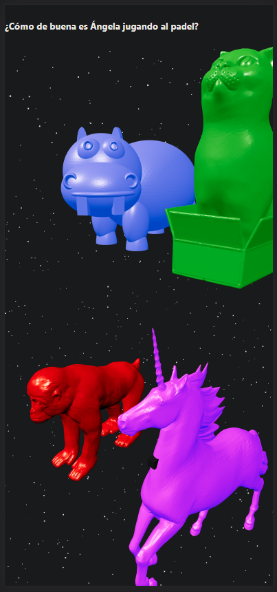
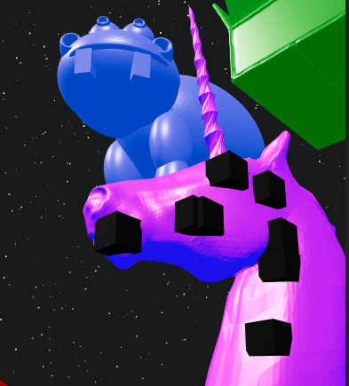

# 3d stl multiplayer:

## To use:
The idea is that you ask a question with your group of friends with 4 different options. The question appears on top and the ansers are read by the game owner.

  

The four alternatives are displayed as a 3d model, every user has 10 selectors for pressing the stl they preffer acording the previously read answer. 

## Example:
I think as a player that the correct answer is the second one so I will press 10 times the green cat in order to show everyone my choice.

  

## How does it works:
There is a websocket on every player browser and every time they press on a model they will send the 3d location of their press and everyone will see their response on real time.

SignalR from .net core is used and also the React client library from Microsoft to handler all the communication.

## Recomendation:
Do not ask real questions, joking is your best plan, also playing with some beers is a good alternative. 